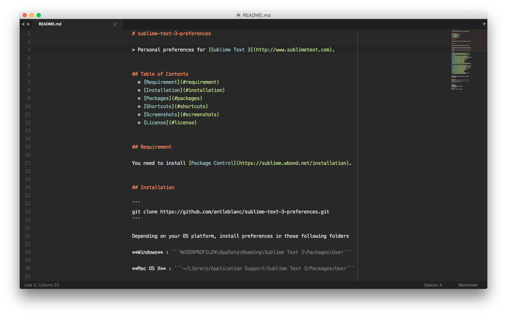
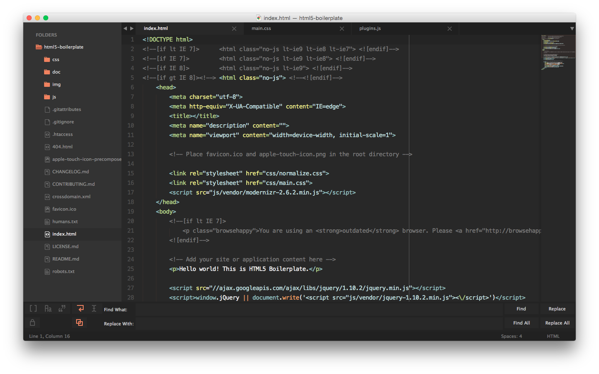

# sublime-text-3-preferences

> Personal preferences for [Sublime Text 3](http://www.sublimetext.com).

## Table of Contents

- [Requirement](#requirement)
- [Installation](#installation)
- [Packages](#packages)
- [Shortcuts](#shortcuts)
- [Screenshots](#screenshots)
- [Resources](#resources)
- [License](#license)

## Requirement

You need to install [Package Control](https://sublime.wbond.net/installation).

## Installation

```sh
git clone https://github.com/antleblanc/sublime-text-3-preferences.git
```

Depending on your OS platform, install preferences in those following folders

**Windows** : ```%USERPROFILE%\AppData\Roaming\Sublime Text 3\Packages\User```

**Mac OS X** : ```~/Library/Application Support/Sublime Text 3/Packages/User```

## Packages

- [AdvancedNewFile](https://packagecontrol.io/packages/AdvancedNewFile)
- [Alignment](https://packagecontrol.io/packages/Alignment)
- [ApacheConf.tmLanguage](https://packagecontrol.io/packages/ApacheConf.tmLanguage)
- [AutoFileName](https://packagecontrol.io/packages/AutoFileName)
- [Autoprefixer](https://packagecontrol.io/packages/Autoprefixer)
- [BracketHighlighter](https://packagecontrol.io/packages/BracketHighlighter)
- [DocBlockr](https://packagecontrol.io/packages/DocBlockr)
- [EditorConfig](https://packagecontrol.io/packages/EditorConfig)
- [Emmet](https://packagecontrol.io/packages/Emmet)
- [FTPSync](https://packagecontrol.io/packages/FTPSync)
- [GitGutter](https://packagecontrol.io/packages/GitGutter)
- [Grunt](https://packagecontrol.io/packages/Grunt)
- [Gulp](https://packagecontrol.io/packages/Gulp)
- [Jade](https://packagecontrol.io/packages/Jade)
- [LiveStyle](https://packagecontrol.io/packages/LiveStyle)
- [Markdown Preview](https://packagecontrol.io/packages/Markdown%20Preview)
- [Nettuts+ Fetch](https://packagecontrol.io/packages/Nettuts%2B%20Fetch)
- [Package Control](https://packagecontrol.io/packages/Package%20Control)
- [PHP-Twig](https://packagecontrol.io/packages/PHP-Twig)
- [PlainTasks](https://packagecontrol.io/packages/PlainTasks)
- [Predawn](https://packagecontrol.io/packages/Predawn)
- [SCSS](https://packagecontrol.io/packages/SCSS)
- [Siteleaf Liquid Syntax](https://packagecontrol.io/packages/Siteleaf%20Liquid%20Syntax)
- [Smarty](https://packagecontrol.io/packages/Smarty)
- [SublimeLinter](https://packagecontrol.io/packages/SublimeLinter)
- [SublimeLinter-contrib-scss-lint](https://packagecontrol.io/packages/SublimeLinter-contrib-scss-lint)
- [SublimeLinter-csslint](https://packagecontrol.io/packages/SublimeLinter-csslint)
- [SublimeLinter-jscs](https://packagecontrol.io/packages/SublimeLinter-jscs)
- [SublimeLinter-jshint](https://packagecontrol.io/packages/SublimeLinter-jshint)

## Shortcuts

| Windows          | OS X            | GNU/Linux        | Description   |
| ---------------- | --------------- | ---------------- | ------------- |
| Ctrl+Alt+F       | n/a             | n/a              | fetch command |

## Screenshots




## Resources

- [Package Control - Syncing](https://sublime.wbond.net/docs/syncing)

## Todo

- Add Shortcuts
- Add Snippets
- Add sublime-keymap for OS X and GNU/Linux
- Documentation

## License

MIT © [Antoine Leblanc](http://antleblanc.me)
