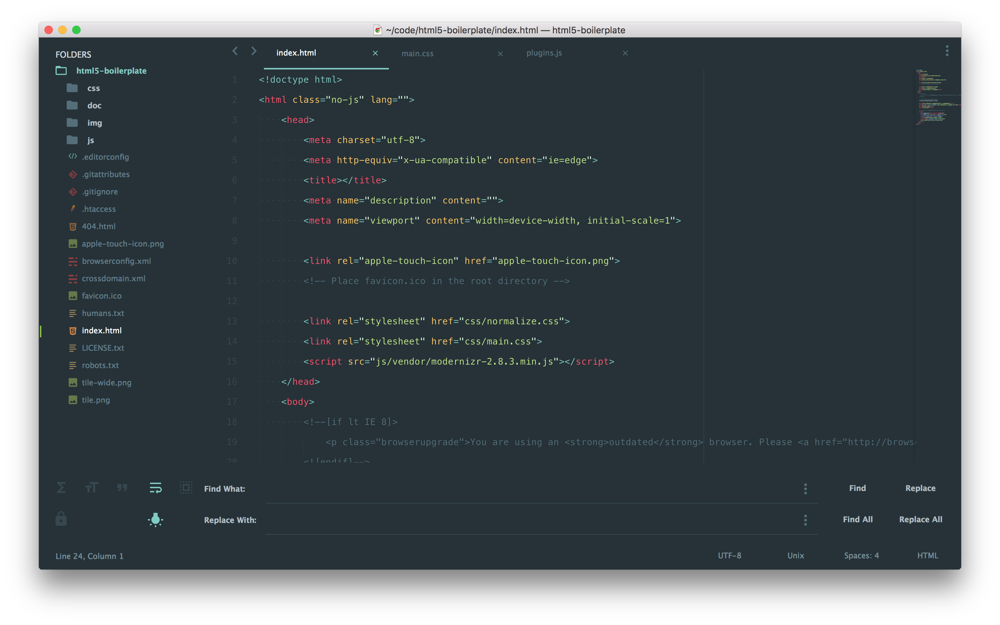

# sublime-text-3-preferences

> Personal preferences for [Sublime Text 3](http://www.sublimetext.com).

## Table of Contents

- [Requirement](#requirement)
- [Installation](#installation)
- [Packages](#packages)
- [Shortcuts](#shortcuts)
- [Screenshot](#screenshot)
- [Resources](#resources)

## Requirement

First you need to install [Package Control](https://packagecontrol.io/installation).

### System requirement

- [Git](https://git-scm.com)
- [Node.js](https://nodejs.org)
- [Ruby](https://www.ruby-lang.org)

#### Node modules

- [grunt-cli](https://www.npmjs.com/package/grunt-cli)
- [gulp](https://www.npmjs.com/package/gulp)
- [csslint](https://www.npmjs.com/package/csslint)

#### Ruby gem

- [scss_lint](https://rubygems.org/gems/scss_lint)

## Installation

```sh
$ git clone https://github.com/antleblanc/sublime-text-3-preferences.git
```

Depending on your OS platform, install preferences in those following folders

**Windows** : `%USERPROFILE%\AppData\Roaming\Sublime Text 3\Packages\User`  
**OS X** : `~/Library/Application Support/Sublime Text 3/Packages/User`

## Packages

- [AdvancedNewFile](https://packagecontrol.io/packages/AdvancedNewFile)
- [Alignment](https://packagecontrol.io/packages/Alignment)
- [ApacheConf.tmLanguage](https://packagecontrol.io/packages/ApacheConf.tmLanguage)
- [AutoFileName](https://packagecontrol.io/packages/AutoFileName)
- [Autoprefixer](https://packagecontrol.io/packages/Autoprefixer)
- [BracketHighlighter](https://packagecontrol.io/packages/BracketHighlighter)
- [Color Highlighter](https://packagecontrol.io/packages/Color%20Highlighter)
- [DocBlockr](https://packagecontrol.io/packages/DocBlockr)
- [EditorConfig](https://packagecontrol.io/packages/EditorConfig)
- [Emmet](https://packagecontrol.io/packages/Emmet)
- [GitGutter](https://packagecontrol.io/packages/GitGutter)
- [Grunt](https://packagecontrol.io/packages/Grunt)
- [Gulp](https://packagecontrol.io/packages/Gulp)
- [Jade](https://packagecontrol.io/packages/Jade)
- [Markdown Preview](https://packagecontrol.io/packages/Markdown%20Preview)
- [Nettuts+ Fetch](https://packagecontrol.io/packages/Nettuts%2B%20Fetch)
- [Package Control](https://packagecontrol.io/packages/Package%20Control)
- [PHP-Twig](https://packagecontrol.io/packages/PHP-Twig)
- [PlainTasks](https://packagecontrol.io/packages/PlainTasks)
- [SCSS](https://packagecontrol.io/packages/SCSS)
- [Seti_UI](https://packagecontrol.io/packages/Seti_UI)
- [Smarty](https://packagecontrol.io/packages/Smarty)
- [SublimeLinter](https://packagecontrol.io/packages/SublimeLinter)
- [SublimeLinter-contrib-scss-lint](https://packagecontrol.io/packages/SublimeLinter-contrib-scss-lint)
- [SublimeLinter-csslint](https://packagecontrol.io/packages/SublimeLinter-csslint)
- [SublimeLinter-php](https://packagecontrol.io/packages/SublimeLinter-php)
- [SublimeLinter-phpcs](https://packagecontrol.io/packages/SublimeLinter-phpcs)

## Shortcuts

| Windows          | OS X            | GNU/Linux        | Description   |
| ---------------- | --------------- | ---------------- | ------------- |
| ctrl+alt+f       | alt+shift+f     | n/a              | fetch command |

## Screenshot



## Resources

- [Package Control - Syncing](https://packagecontrol.io/docs/syncing)

## License

MIT © [Antoine Leblanc](https://antleblanc.com)
